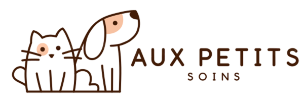

  

<h1 align="center">🐾 Aux Petits Soins</h1>

<em>Visites à domicile pour vos animaux — Bussigny, Ouest lausannois et ses environs.</em>

Site web vitrine de **Sophie**, pet-sitteuse douce et attentive. Amoureuse inconditionnelle des animaux, elle prend soin de vos compagnons comme s'ils étaient les siens — qu'ils soient poilus, à écailles ou à huit pattes — pendant vos déplacements.

Au-delà de la gamelle, chaque visite comprend des soins essentiels (nourriture, litières, traitements médicaux), du bien-être (promenade, jeux, brossage, câlins) et des nouvelles régulières par SMS ou WhatsApp. Un premier rendez-vous à domicile permet de faire connaissance et de s'adapter aux besoins de chaque animal.

## 🌐 Le site

👉 **[Découvrir le site](https://auxpetitssoins.github.io/siteweb/)**

## 📱 Retrouvez Sophie

- [Rover](https://www.rover.com/members/sophie-s-woaf/)
- [Cat in a Flat](https://catinaflat.ch/members/sophie-s-woaf/)
- [Pet Sitting 24](https://petsitting24.ch/fr/providers/4837804?public_view=true)
- [Instagram](https://www.instagram.com/aux_petits_soins_1030)
- [Facebook](https://www.facebook.com/people/Aux-Petits-Soins/61590777627821/)

## ✉️ Contact

auxpetitssoins1030@gmail.com

## 🛠️ Technique

Site statique en HTML/CSS/JavaScript (une seule page, `index.html`). Le formulaire de contact utilise [Formspree](https://formspree.io/). Polices via Google Fonts (Fraunces & Nunito).

---

*Fait avec 💛 pour les museaux, pattounes et autres compagnons.*
